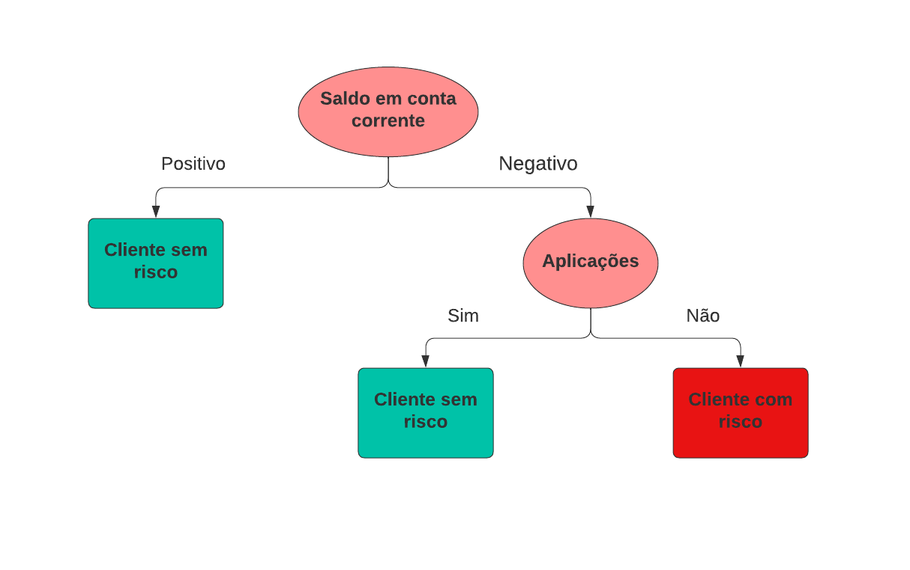
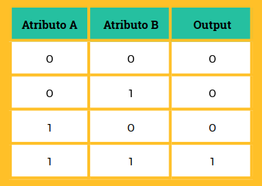
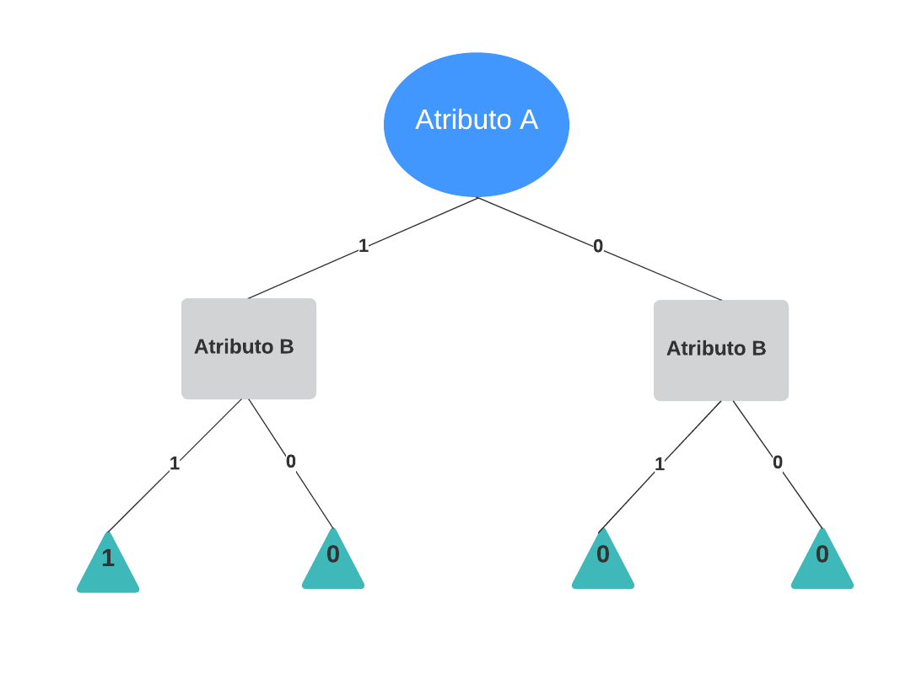
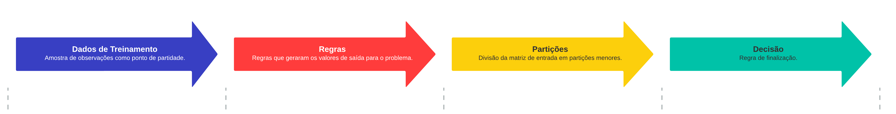

# ÁRVORES DE DECISÃO OU DECISION TREE

## Introdução ao Tema 🐉

Uma árvore de decisão é uma ferramenta de apoio a decisão, que graficamente apresenta a forma de uma árvore de cabeça para baixo. O conceito que rege os modelos de aprendizagem baseado em árvore de decisão, consiste em definir um conjunto de regras e para cada regra há uma decisão que precisa ser tomada. O grande desafio então é fazer com que os computadores aprendam todas essas regras e automaticamente decida por qual caminho seguir.

Árvores de decisão, classificam as instâncias de dados através de uma estrutura de ávore de cabeça para baixo. Para que a decisão ocorra o fluxo começa na raíz, existem então as condições ou checagem que vão determinar o próximo passo do fluxo, que são chamados de nós ou nodes. A decisão propriamente dita ocorre nas folhas. Traduzindo isso para a linguagem do algoritmo, os nós representam os atributos, os branchs ou ramos representam os valores que os atributos podem assumir e as checagens de condições representam exatamente o valor de cada um dos atributos.

As árvores de decisão podem ser usadas para problemas de classificação ou regressão. Para problemas de classificação chamamos de *árvores de classificação* e para problemas de regressão chamamos de *árvores de regressão*.

## Considerações na construção de árvores de decisão  🐝

Consideremos uma tabela de dados, com dados de entrada (Atributo A e Atributo B) e dados de saída (Output). Observe que os dados de saída são binários, ou seja, 0 ou 1. Sendo assim temos um problema de classificação.

 

Uma árvore de decisão possível para resolver esse problema de classificação é selecionar o Atributo A para o nó raiz e o Atributo B para os nós filhos ou nós internos.

Podemos nos questionar sobre o porque do *Atributo A* e não o *Atributo B* foi escolhido para o nó raiz? E quantas árvores distintas poderiamos ter construir? Essas perguntas são fundamentais para a construção de árvores de decisão.

Podemos formular três perguntas principais que determinam a construção de árvores de decisão.

- 1) Qual atributo deve ser usado para iniciar a árvore?

- 2) Qual deve ser o atributo seguinte?

- 3) Quando para de construir ramos na árvore de decisão?

Precisamos então de algum método para sabermos por qual atributo começamos e por qual sequência colocamos os demais atributos. Temos várias técnicas para isso, as principais são:

## Processo de Aprendizagem dos Algoritmos de Árvore de Decisão 🦇

Usando uma amostra de observações como ponto de partida um algoritmo de árvore de decisão identifica as regras que geraram as classes de saída em problemas de classificação ou então valores numéricos para problemas de regressão. E divide a matriz de entrada em partições menores até que o processo assione uma regra de finalização.

Basicamente o algoritmo de árvore de decisão realiza uma busca dentre todas as formas possíveis de dividir a amostra de treinamento e decidir qual divisão maximixa as medidas estatísticas das partições resultantes. E esta busca pelas regras e divisão das partições e feito através de uma característica dos algoritmos de árvore de decisão chamada *Greedy Search* (Busca Gananciosa ou Gulosa). O algoritmo procura maximizar o passo atual sem olhar para o passo seguinte, a fim de alcançar uma ótimização global.
